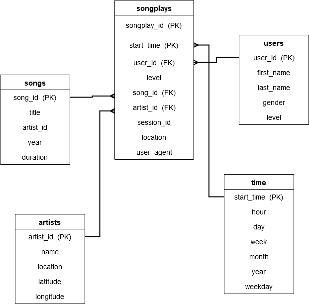

# Sparkify Song Analysis Schema and ETL Load Pipeline  

## Introduction
This ETL solution has been developed an to an easy way to query Sparkify song and users data,  which resides in a directory of JSON logs on user activity on the app, as well as a directory with JSON metadata on the songs in their app.  

The tables have been designed to optimize queries on song play analysis, by creating a star database schema and ETL pipeline for this analysis.  

The Sparkify ETL (Extract-Transform-Load) pipeline fetches data from the /data folder in the workspace,
and creates a Postgres database called sparkifydb to store the data.   
Data regarding each song is present in /data/song_data  
Log files containing user, session, and song play data are present in /data/log_data

Data is extracted from each file using the pandas.read_json() method to create dataframes
that are transformed with operations to rows to persist in tables.  

The script **create_tables.py** calls the SQL Queries present in the file, **sql_queries.py**,  
to create database tables.

The program **etl.py** generates a list of filepaths from /data/song_data and /data/log_data  
and runs the ETL process to load data into the created tables.  

## Run Instructions 
1. The Jupyter notebook run.ipynb has cells to run the create table scripts and the etl process.  
   Run the cells in sequence.
2. Verify that data is inserted with the test.ipynb Jupyter notebook.

## Data Modeling

Fact Dimension Tables 

PK : Primary Key  
FK : Foreign Key  

### Notes  

In order to accomodate Foreign Keys in the songplay fact table, the order of table creation in sql_queries.py  
had to be modified. The table creation order was modified to create dimensions, before the fact table.  
The test Jupyter notebook also was changed to capture table names from the query via regex capture groups instead. This was a much better way to obtain table names.  
Further Extract and Load optimizations are possible by using chunking while calling read_json, and COPY FROM postgres syntax, however since that would require replacing the INSERT QUERY syntax, this has been avoided.